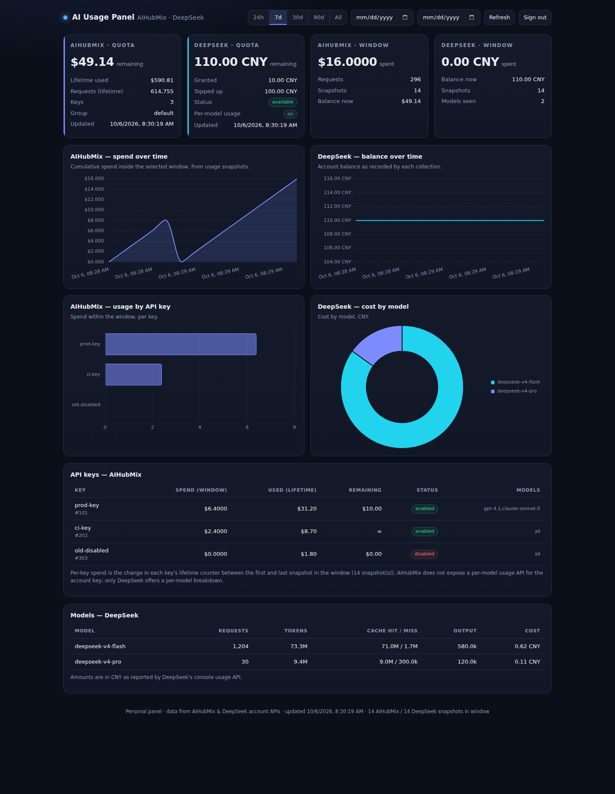

# AI Usage Panel

A single self-hosted dashboard for **AIHubMix** and **DeepSeek** account usage:
remaining quota, spend over time, usage broken down by API key, and (for
DeepSeek) cost by model — with a date-range selector.

Deployed as one Vercel project: static `index.html` + serverless functions in
`api/`, backed by a Neon Postgres database that stores usage snapshots.



---

## What data actually exists (read this first)

Neither provider publishes a full historical usage API, so the panel does two
things: it reads what the account APIs expose live, and it **appends a snapshot
on every collection** so that spend-over-time and per-key deltas can be derived
from the snapshots afterwards.

| Question | AIHubMix | DeepSeek |
| --- | --- | --- |
| Remaining quota / balance | ✅ `/api/user/self` → `quota` | ✅ `/user/balance` |
| Lifetime usage | ✅ `used_quota`, `request_count` | ❌ (derived from balance drops) |
| Usage **by API key** | ✅ `/api/token/` → `used_quota`, `remain_quota` per key | ❌ (no per-key API) |
| Usage **over a time period** | ⚠️ derived from snapshots (deltas) | ⚠️ derived from snapshots, plus official daily rows when the platform token is set |
| Usage **by model** | ❌ no API | ✅ console usage API (optional token) |
| Per-request log | ❌ console only | ❌ console only |

**Consequence:** AIHubMix per-model usage is not available to any programmatic
client — its console has the data, but the endpoint behind it
(`/call/log/usage/by_key`) authenticates with a browser *session* (Clerk JWT),
not the Manage Key. That is why the "cost by model" chart is DeepSeek-only. The
per-key chart and spend-over-time chart cover AIHubMix.

> **Snapshots are the point.** The more often the panel is opened (or the cron
> runs), the finer the spend-over-time resolution. Opening the panel triggers a
> collection automatically when the newest snapshot is older than 5 minutes.

---

## How it works

```
browser ──► Vercel (same origin)
             ├── index.html              static dashboard (vanilla JS + Chart.js)
             └── /api/*                  serverless functions
                  ├── auth     password → HMAC session token
                  ├── collect  read both providers, append a snapshot
                  ├── overview current quotas/balances (+ auto-collect if stale)
                  └── usage    time-series, by-key, by-model for a date range
             │
             ├──► AIHubMix  /api/user/self, /api/token/          (Manage Key)
             ├──► DeepSeek  /user/balance                        (API key)
             ├──► DeepSeek  console usage API                    (optional token)
             └──► Neon Postgres   snap_* + ds_usage_daily tables
```

* **Credentials never touch the browser.** They live only in Vercel env vars and
  are used by the functions.
* **One password** protects the whole thing; tokens are stateless HMAC
  (no session table), sent as `Authorization: Bearer`.
* **Files in `api/` that start with `_` are not routed** — they are shared
  modules (`_lib`, `_db`, `_providers`, `_collect`).

---

## What to fill in `.env`

Copy `.env.example` → `.env` for local dev, and paste the **same keys** into
Vercel → Project → Settings → Environment Variables (Production + Preview).

| Variable | Required | Where to get it |
| --- | --- | --- |
| `AUTH_PASSWORD_HASH` | ✅ | `npm run hash-password -- "your-password"` |
| `AUTH_TOKEN_SECRET` | ✅ | printed by the same command (or `openssl rand -hex 32`) |
| `DATABASE_URL` | ✅ | Neon → Connection Details → **Pooled** connection string |
| `AIHUBMIX_MANAGE_KEY` | ✅ | console.aihubmix.com → Settings → **Generate System Access Token** (`fd…`) |
| `DEEPSEEK_API_KEY` | ✅ | platform.deepseek.com → API keys (`sk-…`) |
| `DEEPSEEK_PLATFORM_TOKEN` | optional | see below — enables per-model/per-day DeepSeek usage |
| `CRON_SECRET` | recommended | any random string; also set the same value in Vercel |
| `AIHUBMIX_BASE_URL` | optional | default `https://aihubmix.com` |
| `ALLOWED_ORIGIN` | optional | only if the page is hosted on a different origin than `/api` |

### 1. Panel password

```bash
npm install
npm run hash-password -- "pick-a-password"
```

Paste both printed lines into `.env`. The password itself is never stored —
only its scrypt hash. (Omit the argument and the command generates one for you.)

### 2. Neon database (click-by-click)

1. Go to <https://neon.com> and sign in (free tier is fine).
2. **Create project** → give it any name → pick the region closest to you → Create.
3. On the project page open **Connection Details**.
4. Choose the **Pooled connection** toggle (the host contains `-pooler`).
5. Copy the whole `postgresql://…` string. Keep `?sslmode=require` at the end.
6. Make it `DATABASE_URL`.

You do **not** need to run any SQL by hand: the app creates its tables on first
use. (Optionally: `psql "$DATABASE_URL" -f schema.sql` to create them up front.)

### 3. AIHubMix Manage Key

1. Sign in at <https://console.aihubmix.com>.
2. Open **Settings** and click **Generate System Access Token**.
3. Copy the token — it starts with `fd`. Make it `AIHUBMIX_MANAGE_KEY`.

> This is **not** the `sk-…` key you use to call models. The Manage Key is what
> the account API (`/api/user/self`, `/api/token/`) accepts.

### 4. DeepSeek API key

1. Sign in at <https://platform.deepseek.com>.
2. Open **API keys**, create one, copy it (`sk-…`). Make it `DEEPSEEK_API_KEY`.

### 5. DeepSeek per-model usage (optional)

DeepSeek has **no official usage API**. The console's internal endpoint
(`/api/v0/usage/amount` + `/cost`) returns per-model, per-day usage, but it
authenticates with a **browser session token**, not the API key.

1. Sign in at <https://platform.deepseek.com>.
2. Open DevTools → **Console** and run:
   ```js
   JSON.parse(localStorage.getItem('userToken')).value
   ```
3. Copy the string into `DEEPSEEK_PLATFORM_TOKEN`.

Treat this like a session cookie: it is personal, it expires, and it may break
if DeepSeek changes the endpoint. Leave it blank and the per-model section is
simply hidden; everything else keeps working. Cost is recorded in **CNY**
(DeepSeek's platform billing currency) — override with
`DEEPSEEK_USAGE_CURRENCY` if yours differs.

---

## Deploy on Vercel

1. Push this repo to GitHub, then **Add New → Project** in Vercel and import it.
2. Framework Preset: **Other**. Leave Build Command and Output Directory empty —
   Vercel serves `index.html` from the repo root and auto-detects `api/`.
3. Add every env var from the table above (Production **and** Preview).
4. Deploy, then open the URL and sign in with your panel password.
5. Open the panel once (or hit **Refresh**) to record the first snapshot.

The optional cron in `vercel.json` runs `/api/collect` daily at 03:00 UTC. It
needs `CRON_SECRET` set; Vercel sends it as `Authorization: Bearer <CRON_SECRET>`.
On the Hobby plan crons may only run **once per day** — raise the frequency on a
paid plan, or just rely on collections triggered when you open the panel.

---

## Local development

```bash
npm install
cp .env.example .env      # fill it in
npm run dev               # http://localhost:3000
```

`dev-server.js` serves `index.html` and routes `/api/*` to the *same* handler
modules Vercel runs, so local and production behave identically.
Set `DEV_HOT=1` to re-require handlers on every request (note: that resets
module-scoped state such as the login rate limiter).

## Tests

```bash
node test/mock-upstream.js 3100 &   # fake provider API
npm run dev &
bash test/api-battery.sh            # 35 assertions: auth, CORS, collect, usage
node test/render-check.js http://127.0.0.1:3000 "$TOKEN" shot.png
```

* `test/api-battery.sh` — auth (wrong/forged/expired/rate-limited), authorisation,
  collection, every range and custom from/to, routing.
* `test/render-check.js` — drives headless Chromium over CDP, screenshots the
  dashboard, and **fails on any page or console error**.
* The rate-limit assertion locks login from that IP for ~15 minutes; restart the
  dev server to clear it.

## Security notes

* `AUTH_TOKEN_SECRET` missing ⇒ token signing/verification **fails closed**.
* Login rate limiting counts **failures only** — a correct password is never
  blocked.
* `ALLOWED_ORIGIN` is a comma-separated allowlist; the API echoes the request
  origin only when it matches, never `*`. Leave it blank for same-origin deploys.
* `.env` is gitignored; only `.env.example` is committed.
